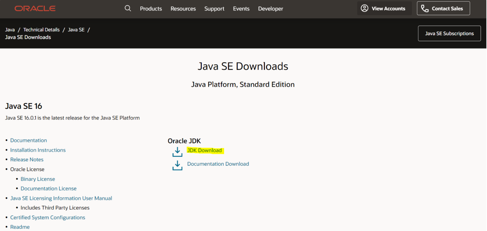
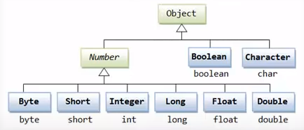

# Java Study

- 유튜브의 동빈나 - 자바 기초 프로그래밍 강좌

# `07.07`

✅ 자바는 모든 것이 `클래스 기반에서 동작`해야 한다는 특징을 가진다.

# 개발 환경 세팅

✅ **개발 환경**

: 자바로 프로그램을 만들 수 있는 컴퓨터 환경으로 프로그램 소스를 작성하는 툴, 작성한 소스를 컴파일하는 프로그램 등을 설치하는 것이다.

✅ **버전**

`스탠다드 버전`과 `LTS 버전`을 구분하는 기준은 안정성이다.

개발하는 환경이 새로운 기능이 포함된 최신 버전이면 좋지만, 개발 기간이 수 개월 이상인 경우는 개발 환경의 변화로 인해 문제가 발생할 수 있다. 또한, 새로운 최신 버전의 검증할 시간도 고려해야 한다.

LTS 환경이란 이러한 안정성 등을 고려한 환경을 제공한다. 그렇기 때문에 스탠다드 버전은 최신 기능이 포함된 버전이지만, LTS 버전은 안정성을 주안점을 두고 출시한 최신 버전이라 생각할 수 있다.

(출처: https://wookoa.tistory.com/14)

<br>

## JDK(Java Development Kit)설치

자바 개발 환경으로 자바 프로그램을 만들기 위해서는 무조건 이것을 설치해야 한다.

### 설치 방법

JDK download 검색(https://www.oracle.com/java/technologies/javase-downloads.html)



### 환경 변수 설정

JDK를 설치하면 javac를 바로 사용할 수 있는 것이 아니라 환경 변수를 설정해주어야 정상적으로 CMD(명렬프롬포트)에서  javac를 입력했을 때 정상적으로 기능들이 동작한다.(여기서는 컴파일 시킴)

해당 위치에 있는 javac를 실행시켜라는 환경 변수를 설정

**설정 순서**

환경 변수 → Path에서 새로만들기 - C:\Program Files\Java\jdk-16.0.1\bin(경로) 추가 → 시스템 변수에서 새로 만들기 - 이름: JAVA_HOME, 값: C:\Program Files\Java\jdk-16.0.1(경로에서 \bin 빼고) 추가

확인 방법

**설정 확인**

cmd에 javac 입력 시 명령어 집합이 나오게 되면 환경 변수 설정이 끝난 것이다.

<br>

## 이클립스 설치

eclipse download 검색(https://www.eclipse.org/downloads/)

<br>

## 자바소스와 컴파일

- jdk가 설치된 디렉토리 bin안에 javac.exe와 java.exe가 있다.
- `javac`는 java compiler의 약어로 자바파일을 컴파일할 때 사용하는 것이다.

✅ **컴파일**

: 프로그래머가 작성한 소스코드를 컴퓨터가 이해할 수 있는 말(기계어)로 바꾸는 행위이다. 모든 프로그래밍 언어에는 컴파일러 또는 그와 비슷한 기능을 하는 것들이 있다.

- `자바파일`은 우리가 작성해야 할 자바 프로그램을 말한다.

- 자바 프로그램은 .java라는 확장자를 가진 파일로 저장하게 되고 이렇게 저장되는 파일을 자바파일 또는 자바소스라고 한다.

- 자바로 작성한 파일을 실행하는 단계

  1. 컴파일 단계 : .java파일을 .class로 바꾸어 주는 단계
  2. 실행 단계 : .class파일을 실행시키는 단계

- 예시

  1. 소스코드(MyProgram.java)를 작성한다.

  2. 컴파일러는 자바 소스코드를 이용하여 클래스 파일(MyProgram.class)을 생성한다. 컴파일 된 클래스 파일은 Java VM(Java Virtual Machine)이 인식할 수 있는 바이너리 파일이다.

     ✅ **VM**

     : 휴대전화에서 콘텐츠나 애플리케이션을 단말기 내에서 실행할 수 있는 환경을 제공하는 가상머신의 모바일 운영체제를 말한다.

  3. Java VM(JVM)은 클래스 파일의 바이너리 코드를 해석하여 프로그램을 수행한다.

  4. MyProgram 수행 결과가 컴퓨터에 반영된다.

### 자바의 컴파일한 결과가 exe가 아닌 class인 이유

- C 또는 C++ 등으로 작성된 프로그램은 최종 결과물로  exe프로그램을 만들어 낸다.

- exe파일은 계산기와 같은 유틸리티일수도 게임일 수도 있다. exe프로그램을 실행하기만 하면 프로그램을 실행시켜볼 수 있다.

- C, C++과 같은 언어는 컴파일 된 실행 파일을 모든 운영체제에서 동일하게 사용하는 것이 불가능하다.

  ex) 윈도우에서 컴파일한 프로그램을 리눅스에서 사용 불가능! → 자바의 JVM과 같은 중간 단계의 역할을 수행하는 것이 없기 때문이다.

- C, C++등의 언어에서 만들어진 실행파일은 JVM같은 중간 단계를 거치지 않으므로 빠른 속도로 수행된다. 하지만 운영체제마다 별도의 실행파일을 작성해야 한다는 단점이 있다.

- 자바는 **JVM을 사용하기 때문에 C등의 언어보다 속도가 느리다**. 하지만 **한번 작성한 파일은 어떤 OS에서라도 사용할 수 있다는 장점**이 있다.

**⇒ 한번 작성한 것을 널리 재활용하는 것이 자바의 가장 큰 특징이자 장점 !**

### 실행 오류

**자바 모듈 오류 Error occurred during initialization of boot layer**

오류가 생기는 이유는 프로젝트를 만들 때 module-info.java 생성을 하도록 체크해 놓았기 때문이다. (module-info.java)

해결 방법 : module-info.java 파일을 삭제하면 된다.

참고 사이트 : https://laughcryrepeat.tistory.com/45

<br>

# `07.08`

# 변수

### 상수

-  상수는 메인함수 바깥쪽에 선언

- final은 한번 선언하면 바뀔 수 없다는 의미
- static 하나의 클래스에서 공유하는 어떠한 자원

:heavy_check_mark: 상수는 바뀔 수 없는 값이기 때문에 Final을 사용한다.

### 오버플로우

✔ 각각의 자료형에 따른 변수들은 나태낼 수 있는 숫자의 한계를 가지고 있다.

✔ 정해진 범위내에서만 출력한다.

```java
public class Practice3 {

	final static int INT_MAX = 2147483647;
	
	public static void main(String[] args) {
		
		// 오버플로우
		int a = INT_MAX;
		System.out.println(a+1);
		
	}

}
// System.out.println(a); → 2147483647
// System.out.println(a+1); → -2147483648
```

### 변수 관련 상식

- 변수를 선언하고 `초기화`를 하지 않으면 사용할 수 없다.
- 정수를 나타내는 타입 : short, int, long 등 다양한 타입이 존재

- 정수 변수 안에 실수를 넣게 되면 정수 부분만 저장이 된다.(버림)

:heavy_check_mark: 실수 값을 반올림 할 때는 변수에 0.5를 더한 뒤 정수형으로 형변환을  하면 된다.

```java
public class Practice1 {

	public static void main(String[] args) {
		
		// 정수형에 실수형 넣을 때, 변환 필요!
		double b = 5.5;
		int a = (int) (b + 0.5);
		System.out.println(a);

	}

}
// 6
```

<br>

# 자료형

자료형 : 어떤 프로그램 상에서 표현하고 싶은 데이터의 형태를 정의

### 자료형의 크기


### DataType

원시 자료형과 비원시 자료형으로 나누어짐

- 원시 자료형 : boolean, char, byte, short, int, long, float, double

- 비원시 자료형 : String, Array, etc.(다른 자료형을 엮어서 만듦)

C언어와 차이점은 boolean, String 정도

많이 사용되는 자료형 : String, Array, boolean, char, int, double

### 아스키코드

:heavy_check_mark: println : 출력하고 다음 줄로

:heavy_check_mark: ​print : 출력하고 그 줄에 있음

```java
public class Practice2 {

	public static void main(String[] args) {
		
		// 아스키코드 기반으로 a부터 z까지 출력하는 프로그램
		for(char i = 'a'; i <= 'z'; i++)
		{
			System.out.print(i + " ");
		}

	}

}
// a b c d e f g h i j k l m n o p q r s t u v w x y z
```

컴퓨터 내부적으로 아스키코드를 계산

### 진수 변환(format)

:heavy_check_mark: ​%o : 형식지정자, 10진수 → 8진수로 변환

:heavy_check_mark: ​%x : 형식지정자, 10진수 → 16진수로 변환

:heavy_check_mark: f​ormat은 줄 바꿈을 해주지 않기 때문에 \n을 사용

```java
public class Practice3 {

	public static void main(String[] args) {
		
		// 10진수를 8진수 혹은 16진수로 바꾸어 출력
		int a = 300;
		
		System.out.println("10진수 : " + a);
		System.out.format("8진수 : %o\\n", a);
		System.out.format("16진수 : %x", a);

	}

}
// 10진수 : 300
// 8진수 : 454
// 16진수 : 12c
```

### String의 내부 함수 - substring

```java
public class Practice4 {

	public static void main(String[] args) {
		
		// String의 substring함수 활용
		String name = "Kwanggyo";
		System.out.println(name);
		System.out.println(name.substring(0, 5));
		System.out.println(name.substring(5, 8));
		
	}

}
// Kwanggyo
// Kwang
// gyo
```

### ➕

- 정수를 나타내는 자료형이 많은 이유는 각 자료형이 차지하는 메모리 공간의 크기가 다르기 때문

- 소수점 표기 형식을 지수 형식으로 출력하고 싶다면 %e를 이용

- String은 내부적으로 char로 배열로 되어있다.

- String으로 다룰 수 있는 문자의 크기는 4GB → 몇 억 글자

- String은 비원시적인 자료형이기 때문에 내부적으로 함수를 가질 수 있고 하나의 클래스라고 할 수 있다.

<br>

# 연산자

:heavy_check_mark: ​static은 클래스 전반적으로 사용되는 함수

즉, 메인 메소드에서 함수를 사용하려면 함수에도 static을 붙여줘야 한다.

### 거듭제곱

```java
public class Practice6 {

	public static void main(String[] args) {
		
		// pow를 이용한 거듭제곱 작성
		double a = Math.pow(2.0, 10);
		System.out.println("2의 10제곱은 " + (int) a + "입니다.");

	}

}
// 1024
```

### ➕

- 100 < x < 200 → (100 < x) && (x < 200)

- 같은 표현 : i++, i+=1,  i = i+1

<br>

# `07.09`

# 조건문과 반복문

contains : 어떠한 문자열을 포함하는지 검사하는 함수

### 조건문 예시

```java
public class Practice2 {

	public static void main(String[] args) {
		
		// 점수에 따라 다른 메세지를 출력
		int score = 95;
		
		if(score >= 90)
		{
			System.out.println("A+입니다.");
		}
		else if(score >= 80)
		{
			System.out.println("B+입니다.");
		}
		else if(score >= 70)
		{
			System.out.println("C+입니다.");
		}
		else
		{
			System.out.println("F입니다.");
		}

	}

}
// A+입니다.
```

### String 비교, equals

```java
public class Practice3 {

	public static void main(String[] args) {
		
		// 문자열과 정수형을 조건문으로 활용
		String a = "Man";
		int b = 0;
		
		// 자바는 String을 비교할 때 equal()을 이용
		// 이유 : String은 다른 자료형과 다른 문자열 자료형이기 때문에
		if(a.equals("Man"))
		{
			System.out.println("남자입니다.");
		}
		else
		{
			System.out.println("남자가 아닙니다.");
		}
		
		if(b == 27)
		{
			System.out.println("b는 27입니다.");
		}
		else
		{
			System.out.println("b는 27이 아닙니다.");
		}
		
		// 대소문자를 구분하지 않고 같은지 판단
		if(a.equalsIgnoreCase("man") && (b == 27))
		{
			System.out.println("참입니다.");
		}
		else
		{
			System.out.println("거짓입니다.");
		}
	}

}
// 남자입니다.
// b는 27이 아닙니다.
// 거짓입니다.
```

:heavy_check_mark: equals : String을 비교할 때 사용한다. → String은 다른 자료형과 다른 문자열 자료형이기 때문에

:heavy_check_mark: equalsIgnoreCase : 대소문자를 구분하지 않고 비교

### while문 예시

```java
public class Practice4 {

	public static void main(String[] args)
	{
		// While 1부터 1000까지의 합
		int i = 1, sum = 0;
		while(i <= 1000)
		{
			sum += i++;
		}
		System.out.println("1부터 1000까지의 합은 " + sum + "입니다.");

	}

}
// 1부터 1000까지의 합은 500500입니다.
```

### for문 예시(중첩)

```java
public class Practice5 {

	final static int N = 5;	
	
	public static void main(String[] args) {
		
		// for문 : 초기화 부분, 조건 부분, 연산 부분
		for(int i = N; i > 0; i--)
		{
			for(int j = i; j > 0; j--)
			{ 
				System.out.print("*");
			}
			System.out.println();
		}

	}

}
// *****
// ****
// ***
// **
// *
```

### for문 원 출력 예시

```java
public class Practice6 {

	final static int N = 3;
	
	public static void main(String[] args) {
		
		// for문으로 원 출력하기
		// x^2 + y^2 = r^2
		for(int i = -N; i <= N; i++)
		{
			for(int j = -N; j <= N; j++)
			{
				if(i * i + j * j <= N * N) {
					System.out.print("*");
				}
				else
				{
					System.out.print(" ");
				}
			}
			System.out.println();
		}
	}

}
//    *   
//  ***** 
//  ***** 
// *******
//  ***** 
//  ***** 
//    *
```

### ➕

- 모든 조건문과 반복문에서 왠만하면 괄호 쓰기!

:heavy_check_mark: for(;;), while(true)는 무한 루프로 동작한다.

```java
public class Practice7 {

	public static void main(String[] args) {
		
		// 무한 루프, break
		int cnt = 0;
		
		for(;;)
		{
			System.out.println("출력 " + cnt);
			cnt++;
			if(cnt == 5)
			{
				break;
			}
		}

	}

}
// 출력 0
// 출력 1
// 출력 2
// 출력 3
// 출력 4
```

- 무한 루프는 break로 빠져나올 수 있다.

<br>

# 기본 입출력

입출력 : 사용자와의 상호작용을 하는 것

### Java 입출력

Scanner 클래스를 이용하여 사용자와 상호작용을 할 수 있다.

입력 받은 자료는 내부적으로 어떠한 처리를 한 뒤에 다시 사용자에게 그 값을 반환한다.

입출력을 잘 지원한다는 것 → 사용자 인터페이스가 뛰어나다.

### Scanner class

:heavy_check_mark: import java.util.Scanner;

- 자바에서 제공하는 기본 라이브러리

- 입출력을 가능하게 해주고 사용하려면 import를 해야 한다.

- class → 내부적으로 함수를 가질 수 있다.

:heavy_check_mark: ​`System.in` : 콘솔 창에서 입력하는 데이터

:heavy_check_mark: ​`int i = sc.nextInt()` : sc라는 입출력 함수가 콘솔창에서 입력되는 정수를 받아서 i에 넣어줌

:heavy_check_mark: ​`sc.close()` : 정상적으로 입출력하는 변수가 닫히게 해줌

```java
import java.util.Scanner;

public class Practice1 {

	public static void main(String[] args) {
		
		// 정수를 입력받아 출력
		Scanner sc = new Scanner(System.in);
		System.out.print("정수를 입력하세요 : ");
		int i = sc.nextInt();
		System.out.println("입력된 정수는 " + i + "입니다.");
		sc.close();

	}

}
// 정수를 입력하세요 : 10
// 입력된 정수는 10입니다.
```

### File 입출력

```java
import java.io.File;
import java.io.FileNotFoundException;
import java.util.Scanner;

public class Practice2 {

	public static void main(String[] args) {
		
		// File 입출력
		File file = new File("input.txt");
		try {
			Scanner sc = new Scanner(file);
			while(sc.hasNextInt())
			{
				System.out.println(sc.nextInt() * 100);
			}
		} catch (FileNotFoundException e) {
			// 오류 발생 시(file이 없음)
			System.out.println("파일을 읽어오는 도중에 오류가 발생하였습니다.");
		}
		

	}

}
// 10000
// 9000
// 8000
```

:heavy_check_mark: import를 해주고 불러올 수 없는 경우를 위해 try - catch를 import 해준다.

:heavy_check_mark: hasNextInt() : sc가 읽어오고 있는 파일에서 다음으로 읽어올 수 있는 정수가 있는지 확인

- input.txt안의 문자는 띄어쓰기 or 줄 바꿈으로 구분이 되어 있어야 다음으로 읽어올 수 있다.

- 파일을 컨트롤 할 수 있다. → 다른 프로그램도 바꿀 수 있고 다양한 처리가 가능하다.

### ➕

- 주석은 컴파일 단계에서 제거되기 때문에 프로그램의 크기와는 상관이 없다.

:heavy_check_mark: Scanner로 문자열을 입력 받고 싶을 때에는 next() 함수와 nextline() 함수를 활용한다.

<br>

# `07.10`

# 사용자 정의 함수

다양한 동적 웹 애플리케이션을 구현할 때에도 JSP와 같은 자바 기반의 프로그리밍을 할 수 있다. 이 때, 객체지향 프로그래밍의 장점을 살린 MVC 모델을 이용한 구축이 이루어진다.

현실 세계의 다양한 사물을 컴퓨터 내부의 언어로 표현하고 그것을 활용할 수 있다.

### ✅ 객체지향

객체는 일반적으로 말하는 물건을 의미하며 여기서 물건은 단순한 데이터가 아니고 그 데이터의 조작 방법에 대한 정보 또한 포함하고 있어 그것을 대상으로 다루는 수법을 객체지향이라고 한다.

어떠한 사물이 있으면 그 사물에 특징을 살려서 모델링을 할 수 있게 해주고 나아가 객체지향의 프로그래밍 기법을 활용하게 되면 프로그래밍이 아닌 현실 세계에 있는 사물을 다루고 있는 것처럼 느끼게 해줌

### 사용자 정의 함수

- 정해진 특정한 기능을 수행하는 모듈을 의미한다.

- 함수를 적절히 활용하면 하나의 문제를 잘게 분해할 수 있다.
  - ex) 이진 트리 → 삽입, 삭제, 순회 등 다양한 함수의 집합으로 구성, 이것을 메인 함수에서 모두 처리하면 작업의 효율성을 저하 시킬 수 있다.

- 함수는 각각의 모듈로서 쉽게 수정되고 보안될 수 있다.

:heavy_check_mark: 함수를 만들 때에는 반환형, 함수명, 매개변수 순으로 작성한다.

**최대 공약수**

```java
public class Practice1 {

	// 반환형, 함수명, 매개변수
	public static int function(int a, int b, int c) {
		int min;
		if(a > b)
		{
			if(b > c)
			{
				min = c;
			}
			else
			{
				min = b;
			}
		}
		else
		{
			if(a > c)
			{
				min = c;
			}
			else
			{
				min = a;
			}
		}
		for(int i = min; i > 0; i--)
		{
			if(a % i == 0 && b % i == 0 && c % i ==0)
			{
				return i;
			}
		}
		return -1;
	}
	
	public static void main(String[] args) {
		
		// 3개의 정수가 주어졌을 때 최대 공약수
		System.out.println("(300, 200, 150)의 최대 공약수는 " + function(300, 200, 150) + "입니다.");

	}

}
// (300, 200, 150)의 최대 공약수는 50입니다.
```

- 메인 메소드도 하나의 함수 → 종료되면 프로그램이 종료되는 것과 동일하기 때문에 반환형이 없다는 뜻의 `void`를 사용한다.

- `String[] args` : 처음에 콘솔 창에서 프로그래밍 실행할 때 인자 값을 넣어주는 것을 의미

**n번째 약수**

```java
public class Practice1 {

	public static int function(int number, int k) {
		for(int i = 1; i <= number; i++)
		{
			if(number % i == 0)
			{
				k--;
				if(k == 0)
				{
					return i;
				}
			}
		}
		return -1;
	}
	
	public static void main(String[] args) {
		
		// number의 k번째 약수
		int result = function(1000, 10);
		if(result == -1)
		{
			System.out.println("1000의 10번째 약수는 없습니다.");
		}
		else
		{
			System.out.println("1000의 10번째 약수는 "+ result + "입니다.");
		}
	}

}
// 3050의 10번째 약수는 50입니다.
```

- 문자열에서 마지막 단어 추출 예시

:heavy_check_mark: ​`input.charAt()` : input에서 N번째 문자를 하나 뽑아오는 것

:heavy_check_mark: ​`input.length()` : input에서 길이

```java
public class Practice2 {

	public static char function(String input) {
		return input.charAt(input.length() - 1);
	}
	
	public static void main(String[] args) {
		
		// 문자열에서 마지막 단어를 반환하는 함수
		System.out.println("Hello World!의 마지막 단어는 " + function("Hello World!") + "입니다.");

	}

}
// Hello World!의 마지막 단어는 !입니다.
```

**max 값 반환하는 함수**

```java
public class Practice3 {

	public static int max(int a, int b) {
		return (a > b ? a : b);
	}
	
	public static int function(int a, int b, int c) {
		int result = max(a, b);
		result = max(result, c);
		return result;
	}
	
	public static void main(String[] args) {
		
		// max를 이용하여 최댓값을 저장하는 함수
		System.out.println("(123, 789, 456) 중에서 가장 큰 값은 " + function(123, 789, 456) + "입니다.");
	}

}
// (123, 789, 456) 중에서 가장 큰 값은 789입니다.
```

<br>

# 반복 함수와 재귀 함수

- 재귀 함수를 사용하게 되면 특정한 연산이 반복되어 비효율적으로 작동할 수 있다.

​	ex) Fibonacci(50) → 2^50번의 연산

- 이러한 문제 해결을 위해 동적 프로그래밍(DP)이 나온다.

### 예시

**Factorial - 반복 함수**

```java
public class Practice1 {

	public static int factorial(int number) {
		int sum = 1;
		for(int i = 2; i <= number; i++)
		{
			sum *= i;
		}
		return sum;
	}
	
	public static void main(String[] args) {
		
		// 팩토리얼 만들기 - 반복 함수
		System.out.println("5 팩토리얼은 " + factorial(5) + "입니다.");

	}

}
// 5 팩토리얼은 120입니다.
```

**Factorial - 재귀 함수**

```java
public class Practice2 {

	public static int factorial(int number) {
		if(number == 1)
		{
			return 1;
		}
		else
		{
			return number * factorial(number - 1);
		}
	}
	
	public static void main(String[] args) {
		
		// 팩토리얼 만들기 - 재귀 함수
		System.out.println("5 팩토리얼은 " + factorial(5) + "입니다.");
	}

}
// 5 팩토리얼은 120입니다.
```

**Fibonacci - 반복 함수**

```java
public class Practice1 {

	public static int fibonacci(int number) {
		int one = 1;
		int two = 1;
		int result = -1; // 문제 생겼을 경우 반환 값
		if(number == 1)
		{
			return one;
		}
		else if(number == 2)
		{
			return two;
		}
		else
		{
			for(int i = 2; i < number; i++)
			{
				result = one + two;
				one = two;
				two = result;
			}
		}
		return result;
	}
	
	public static void main(String[] args) {
		
		// Fibonacci - 반복 함수 
		System.out.println("피보나치 수열의 10번째 원소는 " + fibonacci(10) + "입니다.");

	}

}
// 피보나치 수열의 10번째 원소는 55입니다.
```

**Fibonacci - 재귀 함수**

```java
public class Practice2 {

	public static int fibonacci(int number) {
		if(number == 1)
		{
			return 1;
		}
		else if(number == 2)
		{
			return 1;
		}
		else
		{
			return fibonacci(number - 1) + fibonacci(number - 2);
		}
	}
	
	public static void main(String[] args) {
		
		// Fibonacci - 재귀 함수 
		System.out.println("피보나치 수열의 10번째 원소는 " + fibonacci(10) + "입니다.");
	}

}
// 피보나치 수열의 10번째 원소는 55입니다.
```

<br>

# `07.11`

# 배열

여러가지 원소가 연속적으로 나열될 수 있고 이것을 처리하는 방법

데이터가 많을 때 효과적으로 처리한다.

### 배열 문법

```java
int [] array = new int[100] // 100은 크기
```

import를 해주는 이유?

→ 기본적으로 자바가 모든 라이브러리를 가지고 있으면 무거워지기 때문에 필요할 때 import한다.

### 예시

**원하는 개수만큼의 배열 생성 및 최댓값 구하기**

```java
import java.util.Scanner;

public class Practice1 {
	
	public static int max(int a, int b) {
		return (a > b) ? a : b;
	}

	public static void main(String[] args) {
		
		// 원하는 개수만큼의 배열 생성 및 최댓값 구하기
		Scanner scanner = new Scanner(System.in);
		System.out.print("생성할 배열의 크기를 입력하세요 : ");
		int number = scanner.nextInt();
		int [] array = new int[number];
		for(int i = 0; i < number; i++)
		{
			System.out.print("배열에 입력할 정수를 하나씩 입력하세요 : ");
			array[i] = scanner.nextInt();
		}
		int result = -1;
		for(int i = 0; i < number; i++)
		{
			result = max(result, array[i]);
		}
		System.out.println("입력한 정수들 중에서 가장 큰 값은 " + result + "입니다.");
	}

}
// 생성할 배열의 크기를 입력하세요 : 5
// 배열에 입력할 정수를 하나씩 입력하세요 : 2
// 배열에 입력할 정수를 하나씩 입력하세요 : 3
// 배열에 입력할 정수를 하나씩 입력하세요 : 5
// 배열에 입력할 정수를 하나씩 입력하세요 : 1
// 배열에 입력할 정수를 하나씩 입력하세요 : 4
// 입력한 정수들 중에서 가장 큰 값은 5입니다.
```

**100개의 랜덤 정수의 평균을 구하는 프로그램**

✔️ `Math.random()`

: 0 ≤ x < 1 사이의 수를 랜덤으로 뽑아온다. ex) 0.123

→ 이를 1 ≤ x < 101로 만들기 위해서는 Math.random() * 100 + 1로 해준다.

```java
public class Practice2 {

	public static void main(String[] args) {
		
		// 100개의 랜덤 정수의 평균을 구하는 프로그램
		int [] array = new int[100];
		for(int i = 0; i < 100; i++)
		{
			array[i] = (int) (Math.random() * 100 + 1);
		}
		int sum = 0;
		for(int i = 0; i < 100; i++)
		{
			sum += array[i];
		}
		System.out.println("100개의 랜덤 정수의 평균 값은 " + sum / 100 + "입니다.");
	}

}
// 100개의 랜덤 정수의 평균 값은 50입니다.
```

<br>

# 다차원 배열

배열이 배열의 원소로 들어가는 구조

### 예시

**10x10의 정수 랜덤 데이터를 생성해서 다차원 배열로 표현**

```java
public class Practice1 {

	public static void main(String[] args) {
		
		// 5x5의 정수 랜덤 데이터를 생성해서 다차원 배열로 표현
		int N = 5;
		int [][] array = new int[N][N];
		for(int i = 0; i < N; i++)
		{
			for(int j = 0; j < N; j++)
			{
				array[i][j] = (int)(Math.random() * 10);
			}
		}
		System.out.println(array);	// 파이썬과 다름 -> 출력값 [[I@1175e2db(이 값은 바뀌지 않음)
		for(int i = 0; i < N; i++)
		{
			for(int j = 0; j < N; j++)
			{
				System.out.print(array[i][j] + " ");
			}
			System.out.println();
		}
	}

}
// [[I@1175e2db
// 8 0 1 2 8 
// 0 9 8 0 5 
// 6 4 1 0 0 
// 8 4 0 1 2 
// 0 5 6 4 4
```

<br>

# 클래스

객체(실세계의 사물)지향의 특징으로 가장 기본이 되는 것으로 현실 세계의 특정한 물건을 지칭할 수 있다.

대표적으로 많이 사용되는 것이 Node 클래스

→ 하나의 장소나 위치를 의미할 수 있으며, 자료구조에서 말하는 이진 탐색 트리의 하나의 서브 트리가 될 수 있다.

하나의 처리할 데이터 단위를 명시할 때 사용

- Car 클래스(new Car();)
  - 속력, 색상, 이름 등

✔️ 어떠한 데이터를 변수로 만들어서 사용하는 것 : 인스턴스화

✔️ 모듈화, 보안적, 인스턴스 사용

- 각각의 기능을 나누어서 다루고 메인에서는 간략하게 다룰 수 있다.

### 예시

**하나의 점을 의미하는 Node 클래스 생성하고 Node 클래스를 이용하여 두 점 사이의 중점을 구하는 프로그램**

✔️ `getX()`나 `setX()`

: x의 값을 가져오거나 설정 가능 -> 기본적인 보안

✔️ `private`

: 외부에서 함부로 접근할 수 없는 형태(외부에서 함부로 바꿀 수 없음)

✔️ `public int getX()`

: x, y의 값을 가져가기 위해서 외부에서 접근할 수 있게 public으로 만들어준다.

✔️ `public void setX(int x)`

: x의 값을 설정하기 위해서

✔️ `this.x = x;`

: 자신이 가지고 있는 고유한 x의 속성을 바꿔줌, 매개변수로 넘어오는 x를 private x에 넣어주는 것

```java
public class Node {
	
	// getX나 setX를 통해 x의 값을 가져오거나 설정가능 -> 기본적인 보안
	private int x;	// private -> 외부에서 함부로 접근할 수 없는 형태(외부에서 함부로 바꿀 수 없음)
	private int y;
	
	public int getX() {	// x, y의 값을 가져가기 위해서 외부에서 접근할 수 있게 public으로 만들어줌
		return x; // 가지고 있는 x를 반환
	}
	
	public void setX(int x) {	// x의 값을 설정하기 위해서
		this.x = x;	// 자신이 가지고 있는 고유한 x의 속성을 바꿔줌, 매개변수로 넘어오는 x를 private x에 넣어주는 것
	}
	
	public int getY() {	
		return y;
	}
	
	public void setY(int y) {	
		this.y = y;
	}
	
	// 생성자 : 인스턴스를 만들어줄 때 자동으로 값을 초기화 해주는 함수, 클래스랑 동일한 이름을 가진다.
	public Node(int x, int y) {
		this.x = x;
		this.y = y;
	}
	
	public Node getCenter(Node other) {	// 다른 노드를 매개변수로 받고 비교를 해서 정중앙의 좌표를 반환해줌
		return new Node((this.x + other.getX()) / 2, (this.y + other.getY()) / 2);
	}

}
public class Practice1 {

	public static void main(String[] args) {
		
		// 하나의 점을 의미하는 Node 클래스 생성
		// Node 클래스를 이용하여 두 점 사이의 중점을 구하는 프로그램
		Node one = new Node(10, 20);
		Node two = new Node(30, 40);
		Node result = one.getCenter(two);
		System.out.println("x: " + result.getX() + ", y : " + result.getY());
	}

}
// x: 20, y : 30
```

<br>

# 상속

불필요한 코드의 수를 줄일 수 있어 효율적인 개발이 가능하다.

✔️ 기본적으로 클래스에서 접근하고 초기값을 넣어 줄 수 있다.

- 마우스 우클릭 → Source → Generate Getters and Setters...
- 마우스 우클릭 → Source → Generate Constructor using fields...

✔️ `super()`

: 자신의 부모 클래스의 생성자를 사용하겠다는 의미

✔️ public class Student `extends Person`

: Person 클래스를 상속 받음

### 예시

**Person 클래스 생성**

**→ Person을 상속받은 Student 클래스 → Student 클래스를 이용한 객체 생성**

```java
public class Person {

	private String name;
	private int age;
	private int height;
	private int weight;
	
	public String getName() {
		return name;
	}
	public void setName(String name) {
		this.name = name;
	}
	public int getAge() {
		return age;
	}
	public void setAge(int age) {
		this.age = age;
	}
	public int getHeight() {
		return height;
	}
	public void setHeight(int height) {
		this.height = height;
	}
	public int getWeight() {
		return weight;
	}
	public void setWeight(int weight) {
		this.weight = weight;
	}
	
	public Person(String name, int age, int height, int weight) {
		super();	// 자신의 부모 클래스의 생성자를 사용하겠다는 의미
		this.name = name;
		this.age = age;
		this.height = height;
		this.weight = weight;
	}
	
	
}
public class Student extends Person{	// 상속

	private String studentID;
	private int grade;
	private double GPA; // 외국식 학점 표현
	
	public String getStudentID() {
		return studentID;
	}
	public void setStudentID(String studentID) {
		this.studentID = studentID;
	}
	public int getGrade() {
		return grade;
	}
	public void setGrade(int grade) {
		this.grade = grade;
	}
	public double getGPA() {
		return GPA;
	}
	public void setGPA(double gPA) {
		GPA = gPA;
	}
	
	public Student(String name, int age, int height, int weight, String studentID, int grade, double gPA) {
		super(name, age, height, weight);	// 자신의 부모가 가지고 있는 생성자를 실행
		this.studentID = studentID;
		this.grade = grade;
		GPA = gPA;
	} 
	
	public void show() {
		System.out.println("-------------------------------");
		System.out.println("학생 이름 : " + getName());
		System.out.println("학생 나이 : " + getAge());
		System.out.println("학생 키 : " + getHeight());
		System.out.println("학생 몸무게 : " + getWeight());
		System.out.println("학생 학번 : " + getStudentID());
		System.out.println("학생 학년 : " + getGrade());
		System.out.println("학생 학점 : " + getGPA());
		
	}
	
}
public class Practice1 {

	public static void main(String[] args) {
		
		// Person 클래스 생성
		// Person을 상속받은 Student 클래스
		// Student 클래스를 이용한 객체 생성
		Student student1 = new Student("홍길동", 20, 180, 70, "20210711", 1, 4.5);
		Student student2 = new Student("길동홍", 21, 181, 71, "20210712", 1, 4.0);
		student1.show();
		student2.show();

	}

}
// -------------------------------
// 학생 이름 : 홍길동
// 학생 나이 : 20
// 학생 키 : 180
// 학생 몸무게 : 70
// 학생 학번 : 20210711
// 학생 학년 : 1
// 학생 학점 : 4.5
// -------------------------------
// 학생 이름 : 길동홍
// 학생 나이 : 21
// 학생 키 : 181
// 학생 몸무게 : 71
// 학생 학번 : 20210712
// 학생 학년 : 1
// 학생 학점 : 4.0
```

**→ Person을 상속받은 Teacher 클래스 → Teacher 클래스를 이용한 객체 생성**

```java
public class Teacher extends Person{

	private String teacherID;
	private int monthSalary;
	private int workedYear;
	
	// 변수 접근 가능하게
	public String getTeacherID() {
		return teacherID;
	}
	public void setTeacherID(String teacherID) {
		this.teacherID = teacherID;
	}
	public int getMonthSalary() {
		return monthSalary;
	}
	public void setMonthSalary(int monthSalary) {
		this.monthSalary = monthSalary;
	}
	public int getWorkedYear() {
		return workedYear;
	}
	public void setWorkedYear(int workedYear) {
		this.workedYear = workedYear;
	}
	// 생성자
	public Teacher(String name, int age, int height, int weight, String teacherID, int monthSalary, int workedYear) {
		super(name, age, height, weight);
		this.teacherID = teacherID;
		this.monthSalary = monthSalary;
		this.workedYear = workedYear;
	}
	
	public void show() {
		System.out.println("--------------------------");
		System.out.println("교사 이름 : " + getName());
		System.out.println("교사 나이 : " + getAge());
		System.out.println("교사 키 : " + getHeight());
		System.out.println("교사 몸무게 : " + getWeight());
		System.out.println("교직원 번호  : " + getTeacherID());
		System.out.println("교사 월급 : " + getMonthSalary());
		System.out.println("교사 연치 : " + getWorkedYear());
		
	}
	
}
```

**학생 정보를 입력받아 배열에 넣어주기**

```java
import java.util.Scanner;

public class Practice2 {

	public static void main(String[] args) {
		
		// 사용자로부터 입력을 받아서 출력
		Scanner scan = new Scanner(System.in);
		System.out.print("총 몇 명의 학생이 존재합니까? ");
		int number = scan.nextInt();
		Student[] students = new Student[number];
		for(int i = 0; i < number; i++)
		{
			String name;
			int age;
			int height; 
			int weight;
			String studentID;
			int grade;
			double gPA;
			System.out.print("학생의 이름을 입력하세요 : ");
			name = scan.next();
			System.out.print("학생의 나이을 입력하세요 : ");
			age = scan.nextInt();
			System.out.print("학생의 키을 입력하세요 : ");
			height = scan.nextInt();
			System.out.print("학생의 몸무게을 입력하세요 : ");
			weight = scan.nextInt();
			System.out.print("학생의 학번을 입력하세요 : ");
			studentID = scan.next();
			System.out.print("학생의 학년을 입력하세요 : ");
			grade = scan.nextInt();
			System.out.print("학생의 학점을 입력하세요 : ");
			gPA = scan.nextDouble();
			students[i] = new Student(name, age, height, weight, studentID, grade, gPA);
		}
		for(int i = 0; i < number; i++)
		{
			students[i].show();
		}
	}

}
```

<br>

# 추상(Abstract)

개발 자체 안정성과 확장 가능성을 보장 받는다.

일종의 미완성인 클래스 → 설계적인 틀을 갖추고 클래스를 작성할 수 있게 한다.

직접적으로 객체 인스턴스를 생성할 수 없지만 새로운 클래스를 생성하는데 밑바탕이 되는 역할

ex) 도형은 사각형, 원, 삼각형이 이지만 공통적으로 넓이를 가진다. 여기서 넓이를 구현하는 것 !

✔️ 추상 클래스를 사용하려면 꼭 상속을 받아야 하며 상속 받은 모든 추상 메소드는 반드시 구현을 해주어야 한다.

✔️ 개발에 필요한 요소를 미리 설계할 수 있다 !

### 예시

**추상의 개념을 이용하여 음악 플레이어 클래스를 구현**

✔️ abstract : 추상 클래스를 정의

```java
abstract class Player {	// abstract : 추상 클래스를 정의
	
	abstract void play(String songName);
	abstract void pause();	// 일시 정지
	abstract void stop();	// 하나의 곡을 정지

}
```

✔️ 상속 받기 위해 public class Practice extends Player를 작성하면 오류가 뜬다.

✔️ Add unimplemented methods를 통해 아직 구현이 안된 것들을 구현을 해준다.

→ 반드시 상속을 받아서 구현을 해줘야 한다.

✔️ `Practice1 main = new Practice1();`

: 메인 메소드는 메인(Practice1) 클래스 안에서 공유하는 스태틱으로 선언된 하나의 메소드이다. 스태틱으로 선언된 메소드 안에서 불러오는 메소드는 스태틱으로 선언되어야 한다. 그렇기 때문에 이렇게 하지 않고 메인(Practice1) 클래스의 main 인스턴스를 만들고 여기서 플레이 해준다.

✔️ `@Override`

: 반드시 구현해야하는 요소를 알려준다. → 설계적인 측면에서 의미, 어떤 함수를 만들어야 하는지 고민하는 시간을 줄임

✔️

```java
public class Practice1 extends Player{

	public static void main(String[] args) {
		
		// 추상의 개념을 이용하여 음악 플레이어 클래스를 구현
		Practice1 main = new Practice1();	// 메인 메소드는 메인(Practice1) 클래스 안에서 공유하는 스태틱으로 선언된 하나의 메소드
								// 스태틱으로 선언된 메소드 안에서 불러오는 메소드는 스태틱으로 선언되어야 함
								// 그렇기 때문에 이렇게 하지 않고 메인(Practice1) 클래스의 main 인스턴스를 만들고 여기서 플레이 해준다
		main.play("Coldplay - Viva La Vida");
		main.pause();
		main.stop();

	}

	@Override	// 반드시 구현해야하는 요소를 알려준다. -> 설계적인 측면에서 의미, 어떤 함수를 만들어야 하는지 고민하는 시간을 줄임
	void play(String songName) {
		
		System.out.println(songName + " 곡을 재생합니다.");
		
	}

	@Override
	void pause() {
		
		System.out.println("곡을 일시정지합니다.");
		
	}

	@Override
	void stop() {
		
		System.out.println("곡을 정지합니다.");
		
	}

}
```

**추상의 개념을 이용하여 동물 클래스를 구현**

✔️ `abstract void crying();`

: 반드시 구현해야 한다는 것을 알려준다!

```java
abstract class Animal {

	abstract void crying();	// 반드시 구현해야 한다는 것을 알려줌 !
}
public class Dog extends Animal {

	@Override
	void crying() {
		
		System.out.println("월! 월!");
		
	}
	
}
public class Cat extends Animal {

	@Override
	void crying() {
		
		System.out.println("야옹");
		
	}
	
}
public class Practice2 {

	public static void main(String[] args) {
		
		// 추상의 개념을 이용하여 동물 클래스를 구현
		Dog dog = new Dog();
		Cat cat = new Cat();
		dog.crying();
		cat.crying();
		
	}

}
```

<br>

# 최종(Final)

절대로 변하지 않는 특정한 것을 정하고 싶을 때 사용한다.

변화하지 않고 보호하기 위해 사용한다.

✔️ 변수, 메소드, 클래스에 모두 사용할 수 있다.

- 변수 : 변하지 않는 상수(Stop Value Change)
- 메소드 : 재정의가 불가능한 메소드(Stop Method Overridding)
- 클래스 : 상속이 불가능한 하나의 완전한 클래스(Stop Inheritance)

### 예시

**Final 키워드를 사용한 변수**

```java
public class Practice1 {

	public static void main(String[] args) {
		
		// Final 키워드를 사용한 변수
		final int number = 10;
		// number = 5; // 에러
		System.out.println(number);

	}

}
```

**Final 키워드를 사용한 함수**

✔️ `public void show() {}`

: 자기 클래스에서 재정의(overridding) -> final이 붙으면 재정의가 불가능해진다.

```java
public class Parent {
	
	public final void show() {
		System.out.println("Hi");
	}

}
public class Practice2 extends Parent {
	
//	public void show() {	// 자기 클래스에서 재정의(overridding) -> final이 붙으면 재정의가 불가능해짐
//		System.out.println("Hello");
//	}

	public static void main(String[] args) {
		
		// Final 키워드를 사용한 함수
		Practice2 main = new Practice2();
		main.show();

	}

}
```

**Final 키워드를 사용한 클래스**

```java
final class Parent2 {

	public final void show() {
		System.out.println("Hi");
	}
}
```

아래의 class는 사용할 수 없다. 사용하기 위해서는 extends Parent2를 지워야 한다.

```java
public class Practice3 extends Parent2{	// 에러 발생 -> final 클래스 상속 불가

	public static void main(String[] args) {
		
		// Final 키워드를 사용한 클래스
		Main main = new Main();
		main.show();

	}

}
```

<br>

# 인터페이스(Interface)

추상 클래스보다 더 추상적인, 더 설계에 가까운 구현 방법 → 일반적으로 추상 크래스보다 인터페이스를 많이 사용한다.

→ 조금 더 설계의 측면에서 체계적으로 작성 가능하다!

다중 상속을 구현하게 해준다.(기본적으로는 안된다.)

✔️ 추상 클래스와 다른 점

- 추상 클래스 : 추상 메소드 외에 멤버 변수나 일반 메소드를 가질 수 있다.
- 인터페이스 : 반드시 사전에 정의된 추상 메소드와 상수만을 가질 수 있다.(추상화의 정도가 높다. → 미리 구현하면 안되고 설계만 한다!)

인터페이스는 팀 프로젝트의 동시 작업에 유리하고 일반적으로 추상보다 요구되는 설계의 기준이 높다. → 더 체계적이다.

### 예시

**인터페이스 선언과 메소드 다루기**

✔️ 아래와 같이 작성하게 되면 오류가 발생한다. → 미리 어떠한 일반 메소드를 가지지 못한다.

```java
public interface Dog {

	abstract void crying();
	public void show() {	// 미리 어떠한 일반 메소드를 못가지게 한다 -> 설계만 가능
							// public interface -> abstract class로 바꾸면 사용 가능
							// 추상 클래스보다 추상화의 정도가 높다.
		System.out.println("Hello World!");
	}
}
```

✔️ 정상 동작을 위해 바꿔준다.

✔️ `implements` 를 통해서 가져온다.

```java
public interface Dog {

	abstract void crying();
	public void show();

}
public class Practice1 implements Dog {

	public static void main(String[] args) {
		
		// 인터페이스 선언과 메소드 다루기
		Practice1 main = new Practice1();
		main.crying();
		main.show();
	}

	@Override
	public void crying() {
		
		System.out.println("월! 월!");
		
	}

	@Override
	public void show() {
		
		System.out.println("Hello World!");
		
	}

}
// 월! 월!
// Hello World!
```

**인터페이스를 통한 다중 상속**

✔️ 추상 클래스로는 다중 상속이 불가능하지만 인터페이스를 사용하면 가능하다.

✔️ `public void show();`

: 추상 클래스에서 public 변수가 들어가면 반드시 몸체를 구현해야 한다.

```java
public interface Dog2 {

	abstract void crying(); 
	// public void show();	// 추상클래스에서 public 변수가 들어가면 반드시 몸체를 구현해야 한다.
	public void one();
	
}
public interface Cat {

	abstract void crying();
	public void two();
	
}
```

✔️ @Override부분에서 겹치는 부분은 하나만 정의해줘도 된다.

```java
public class Practice2 implements Dog2, Cat {

	public static void main(String[] args) {
		
		// 인터페이스 다중 상속
		Practice2 main = new Practice2();
		main.crying();
		main.one();
		main.two();
		
	}

	@Override
	public void crying() {	// 겹치는 부분은 하나만 정의해줘도 된다.
		
		System.out.println("월! 월!");
		
	}

	@Override
	public void two() {
		
		System.out.println("two");
		
	}

	@Override
	public void one() {
		
		System.out.println("one");
		
	}

}
```

<br>

# 다형성(Polymorphism)

다양한 형태의 성질을 가진다는 의미

사용하는 변수 형태를 바꾸어 여러 타입의 객체를 참조할 수 있다. → 소스 코드의 유연성

✔️ 부모 클래스 타입의 참조 변수로 하위 클래스의 객체를 참조할 수 있다.

### 예시

**과일 정보 프로그램**

✔️ `Fruit fruit = new Peach();`

: 자식 클래스의 인스턴스를 자신의 인스턴스 변수로 넣을 수 있다.

✔️ 다형성이 존재하는 이유

: 실제로 구현할 때는 바나나인지 복숭아 인지 사용자가 선택할 수 있게 해준다!

```java
public class Fruit {

	String name;
	int price;
	int fresh;
	
	public void show() {
		System.out.println("이름 : " + name);
		System.out.println("가격 : " + price);
		System.out.println("신선도 : " + fresh);
	}
}
public class Peach extends Fruit {
	
	public Peach() {
		price = 1500;
		name = "복숭아";
		fresh = 75;
//		// 주석 처리하면 -> 변수를 초기화 시켜줘야 정상적으로 사용 가능
//		이름 : null
//		가격 : 0
//		신선도 : 0
	}
}
public class Banana extends Fruit {
	
	public Banana() {
		
		price = 1000;
		name = "바나나";
		fresh = 80;
	}

}
public class Practice1 {

	public static void main(String[] args) {
		
		// 과일 정보 프로젝트
		Fruit fruit = new Peach();	// 자식 클래스의 인스턴스를 자기 자신의 변수로 넣을 수 있다.
		fruit.show();
		Fruit fruit2 = new Banana();	// 다형성이 존재하는 이유 :실제로 구현할 때는 바나나인지 복숭아 인지 사용자가 선택할 수 있게 해준다!
										// 자식 클래스의 인스턴스 변수를 자신의 인스턴스 변수로 넣어줄 수 있다.
		fruit2.show();

	}

}
```

**과일 정보 → 사용자 입력 받기 ⇒ 많이 활용된다.**

✔️ 사용자의 입력을 받아서 출력하는 예시

게임 캐릭터라고 생각하면

- 부모: 게임 캐릭터
- 자식 : 전사, 마법사 등

→ 사용자가 입력한 값에 따라 인스턴스 변수를 쉽게 바꿀 수 있다.

```java
import java.util.Scanner;

public class Practice2 {

	public static void main(String[] args) {
		
		// 사용자의 입력을 받아서 출력
		// ex) 게임 캐릭터라고 생각하면 부모: 게임 캐릭터, 자식 : 전사, 마법사 등 -> 사용자가 입력한 값에 따라 인스턴스 변수를 쉽게 바꿀 수 있다.
		Scanner scanner = new Scanner(System.in);
		System.out.print("바나나 : 1, 복숭아 : 2 ? ");
		int input = scanner.nextInt();
		Fruit fruit;
		if(input == 1)
		{
			fruit = new Banana();
			fruit.show();
		}
		else if(input == 2)
		{
			fruit = new Peach();
			fruit.show();
		}
	}

}
```

<br>

# 객체(Object) 클래스

Object라는 클래스가 존재한다.(여기서는 객체지향의 객체가 아님)

많이 사용되지는 않는다.

기본적으로 모든 객체의 조상 역할을 한다.

존재 이유 : 모든 클래스가 공통으로 포함하고 있어햐 하는 기능을 제공하기 위해



### 예시

**객체를 비교하는 방법(다형성 이용) - 두 가지 인스턴스 비교**

✔️ `public class Archer`

: extends Object를 명시해주지 않아도 상속 받고 있다.

✔️ `Archer temp = (Archer) obj;`

: Object를 Archer 형태로 바꿔준다.

→ 바꿀 수 있는 이유는 object가 Archer의 부모 클래스이기 때문에(다형성) 가능하다.

✔️ `System.out.println(archer1.equals(archer2));`

: 내부적인 값을 비교하는 방법! 알아두기!

```java
public class Archer {	// extends Object를 명시해주지 않아도 가능

	String name;
	String power;
	
	// 생성자
	public Archer(String name, String power) {
		this.name = name;
		this.power = power;
	}
	
	// obj가 Archer 클래스의 인스턴스와 동일한지 비교
	public boolean equals(Object obj) {	// 매개변수로 Object가 들어옴
		Archer temp = (Archer) obj;	// Object를 Archer 형태로 바꿔줌
									// 바꿀 수 있는 이유는 object가 Archer의 부모 클래스이기 때문에(다형성)
		if(name == temp.name && power == temp.power) {
			return true;
		}
		else
		{
			return false;
		}
	}
}
public class Practice1 {

	public static void main(String[] args) {
		
		// 객체를 비교하는 방법
		Archer archer1 = new Archer("궁수1", "상");
		Archer archer2 = new Archer("궁수1", "상");
		System.out.println(archer1 == archer2);	// 두 개의 인스턴스가 내부적인 값은 같지만 그대로 비교하게되면 다르기 때문에(1, 2) false
		System.out.println(archer1.equals(archer2)); // 내부적인 값을 비교

	}

}
```

<br>

# 객체지향의 활용

### 예시

**게임 캐릭터 공격 프로그램**

✔️ `instanceof`

: 해당 클래스의 인스턴스인지 확인

```java
public class Hero {
	
	String name;
	
	public Hero(String name) {
		this.name = name;
	}
	
	public void attack() {
		System.out.println("주먹 지르기!");
	}
}
public class Warrior extends Hero{

	public Warrior(String name) {
		super(name);
	}
	
	public void groundCutting() {
		System.out.println("대지 가르기!");
	}

}
public class Archer extends Hero {

	public Archer(String name) {
		super(name);
	}
	
	public void fireArrow() {
		System.out.println("불화살!");
	}

}
public class Wizard extends Hero {

	public Wizard(String name) {
		super(name);
	}
	
	public void freezing() {
		System.out.println("얼리기!");
	}

}
public class Practice1 {

	public static void main(String[] args) {
		
		// 게임 캐릭터 공격 프로그램
		Hero[] heros = new Hero[3];
		// 다형성 기법 이용
		heros[0] = new Warrior("전사");
		heros[1] = new Archer("궁수");
		heros[2] = new Wizard("마법사");
		
		for(int i = 0; i < heros.length; i++)
		{
			heros[i].attack();
			
			if(heros[i] instanceof Warrior) {	// 해당 클래스의 인스턴스인지 확인
				Warrior temp = (Warrior) heros[i];
				temp.groundCutting();
			}
			else if(heros[i] instanceof Archer) {
				Archer temp = (Archer) heros[i];
				temp.fireArrow();
			}
			else if(heros[i] instanceof Wizard) {
				Wizard temp = (Wizard) heros[i];
				temp.freezing();
			}
		}
	}

}
```